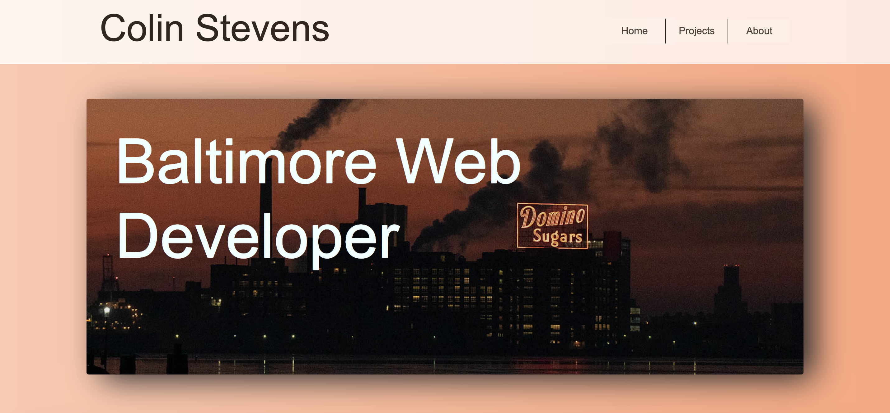

# Portfolio

I'm really excited about how my portfolio turned out but also know I want to make it better in the coming weeks.

Here are links to the project:

-  (GitHub Repo)[https://github.com/colinstevens06/Portfolio]
-  (Live Site)[https://colinstevens06.github.io/Portfolio/]

## Home Page

This was a lot of fun to do. I wanted to use animations on my homepage. I found a YouTube channel - Dev Ed - and used a lot of his methods in my homepage. I used my own image for the hero image.

I wanted a strong hero image that spoke to Baltimore. I also wanted to keep the design simple and clean. I think the landing section does exactly what I want it to do, catching your eye with an iconic Baltimore image and an animation.

Lower on the page, I use a simple icon-based three-pack, linking to relevant content. I like my animation that makes it fly in from the side.

Then my professional bio at the bottom, I like how it flies in from the bottom, giving it a subtle effect.

One thing I would upgrade in the future: I want that animation on the home page to only run once (maybe once per day?), then I want it to revert to standard transition between pages.

## Projects

I used Bootstrap cards for this. Then I used a JS library for the fly-in affects. I want to keep this page's design simple, but wanted some animations to give it life.

## About

Another design case where I wanted a large hero image doing the talking. I took this image of myself while on a hike at the beggining of summer. It's near Hagerstown Maryland. It was about 1.5-mile hike here, I had never been before, but I know it was a great lookout. Taking selfies w/ my Sony Alpha6500 is hard - I can't use autofocus because I'm still behind the camera during focus. Then I press and timer and get in position. This photo was pretty much the most in focus - and the last time I took a portrait-style photo of myself - so I used this one.

I think the overlay on the image could be better. Not in love with it and will look up videos on how to perfect this.

I also think the layout of the body copy could be improved.

I am happy with the simplicity and the way I used a different background color and still maintained readability with my background color and font color.

## Animations in between pages

I used this technique on my Lies From Granny site and used it here, too. I just like the smoothness that it gives while navigating through the pages. Feels less jarring when you're dished the new layouts.
